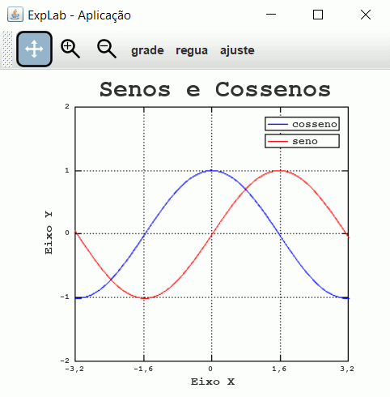
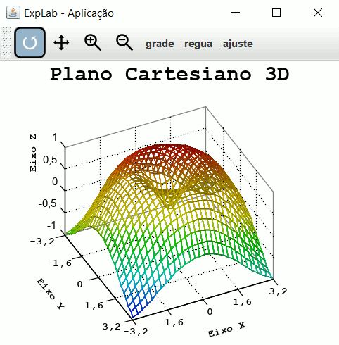
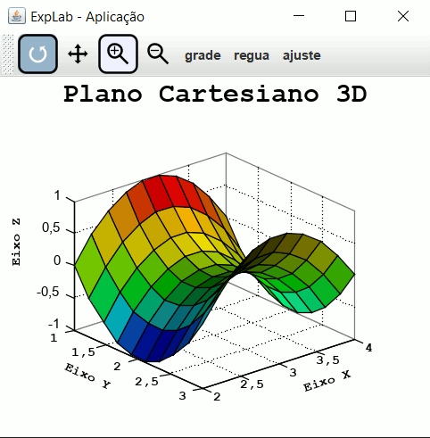
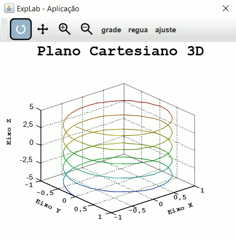

# explab

O ExpLab é um interpretador e linguagem de programação: interpretada, orientada a objetos e a matemática. Ela suporta as estruturas básicas de uma linguagem de programação OO como, por exemplo, os comandos: SE, COMPARE/CASO, ENQUANTO, PARA... inclusive, também suporta definição e chamada de funções, expressões aritméticas e booleans, classes, objetos como variáveis instâncias de classes, herança de classes, tratamento de exceções, organização das classes em pacotes, etc. Inclusive, como linguagem de programação orientada a matemática, a linguagem ExpLab tem suporte a operações com vetores e matrizes e plotagem e visualização de dados e funções matemáticas em 2D e 3D.

Trata-se de um software semelhante a outros já consagrados como: MatLab, SciLab e GNU Octave.

Ao utilizar os softwares já bem sucedidos e semelhantes ao ExpLab, pude perceber que, suas linguagens de script parecem não ser Orientadas a Objetos. Por isso, o suporte a orientação a objetos pelo ExpLab parece ser um diferencial do interpretador. Inclusive, considero o ExpLab como uma ótima escolha para o ensino de programação básica por suportar todos os recursos de linguagens como, por exemplo, a linguagem pascal e ter comandos e palavras chaves em português.

O ExpLab tem uma sintaxe muito parecida com a das linguagems C, C++ e Java. É uma linguagem case insensitive e as variáveis não precisam ser declaradas com tipos definidos. Os tipos das variáveis são detectados automaticamente pelo interpretador, conforme o valor, ou expressão atribuido a variável.

Por enquanto, essa é a descrição do projeto que já tem pronta uma versão funcional com todos os recursos descritos acima. Estou publicando através do GitHub, um software interpretador e linguagem de programação já finalizado. Claro, sempre há algo para melhorar ou acrescentar, então, pretendo dar continuidade ao projeto e, talvez conseguir colaboradores interessados no projeto.

# Exemplo 1

Calcula o fatorial de um número de duas formas: recursiva (primeira função: "fatorial1") e imperativa (segunda função: "fatorial2")

  
<pre>
func fat1( n ) {
    fat = 1;
    enquanto( n > 0 ) {
        fat *= n;
        n--;
    }
	retorne fat;
}

func fat2( n ) {
    fat = 1;
    enquanto ( n > 0 )
       fat &#42;= n--;
    retorne fat;
}

func fat3( n ) {
    fat = 1;
    para ( i=2; i <= n; i++ )
        fat &#42;= i;
    retorne fat;
}

func fat4( n ) {  // recursiva
    se n < 1 
        retorne 1;
    retorne n * fat4( n-1 );
}

exiba "Informe um número: ";
leialn num;

exibaln "Fat1="+fat1( num );
exibaln "Fat2="+fat2( num );
exibaln "Fat3="+fat3( num );
exibaln "Fat4="+fat4( num );
</pre>

# Exemplo 2

Exemplo de operação com matrizes

<pre>
a = [ 1 2 3; 4 5 6 ]^rquad(abs( 2-2*3 )) + (2* ((pot( 2, 4 )*PI^0)*1.0)*3)/4;  
b = a( 1,: );

exibaln a;   // exibe a matriz &#91; 25 28 33; 40 49 60 &#93;
exibaln b;   // exiba a matriz (vetor) &#91; 40 49 60 &#93;
</pre>

# Exemplo 3

Lê um número e verifica se número é par ou impar. Solicita novo número se o número informado for não real. Um exemplo de tratamento de exceções.

<pre>
terminar = verdade;
faca &#123;
    exiba "Informe um numero: ";
    leialn s&#58;string;

    tente &#123;        
        n = strparareal( s );

        se n % 2 == 0 
            exibaln "O número "+n+" é par!";
        senao exibaln "O número "+n+" é impar!";

        terminar = verdade;
    &#125; capture ( RealFormatoException e ) &#123;
        exibaln "Você informou um valor não real. Deseja informar outro número?";
        exibaln " (S/Sim)   - Sim";
        exibaln " (N/Outro) - Não";
        exiba ">> ";
        leialn resp:string;
        resp = maiusculas( resp );
        terminar = ( resp != 'S' &amp; resp != 'SIM' ); 		
    &#125;	
&#125; enquanto ( !terminar );
</pre>

# Exemplo 4

Exemplo de orientação a objetos:

<pre>
classe A {	
    b = novo B();
    b.a = b.c1.multiplica();  // nesse ponto "a" de "c1" vale 2 e "b de "c1" vale 2
                              // logo, a função multiplica retorna 4
	
    b.b = b.c2.multiplica();  // aqui b.b recebe o resultado da função multiplica do objeto c2.
                              // como c2.a vale 1 e c2.b vale 1, a função retorna 1
	
    result = b.multiplica();  // nesse ponto, b.a vale 4 e b.b vale 1, Logo result passa a 
                              // valer 4
    classe B {
        a = 4;
        b = 5;
		
        c1 = novo C();
        c1.a = 2;
		
        c2 = novo C();
        c2.b = 1;
		
        func alteraC1( a, b ) {   // os parâmetros a e b não têm nada há ver com os 	
            c1.a = a;             // atributos "a" e "b" dessa classe
            c1.b = b;
        }
		
        func alteraC2( a, b ) {
            c2.a = a;
            c2.b = b;
        }
		
        func multiplica() {   // diferente de chamar c1.multiplica() ou c2.multiplica()
            retorne a*b;
        }
		
        classe C {
            a = 1;
            b = 2;
			
            func multiplica() {
                retorne a*b;
            }
        }	
    }
}

a = novo A();                  // Não é válido fazer algo tipo: "novo a.B(); ou novo A.B();"

a.b.alteraC1( a.b.a, 10 );     // Nesse ponto, "a.b.a" vale 4 "a.b.c1.a" passa a valer 4 e 
                               // "a.b.c1.b" passa a valer 10

exibaln a.result;              // imprime o valor de a.result: 4
exibaln a.b.c1.multiplica();   // Nesse ponto c1.a vale 4 e c2.a vale 10, logo imprime: 40
exibaln a.b.c2.multiplica();   // Nesse ponto c2.a vale 1 e c2.b vale 1, logo imprime: 1
</pre>

# Exemplo de plotágem 2D
	

<u><b>Exemplo 1:</b></u>	Esse exemplo plota o gráfico da função cosseno com x variando no intervalo de -pi a pi e a função seno no mesmo intervalo.

		
<pre>
<code>
f = novo Func2D( -pi, pi );             // instancia a classe Func2D com os intervalos de X  
f.y1 = -2.0;                            // seta o primeiro intervalo de y
f.y2 = 2.0;                             // seta o segundo intervalo de y
f.limitarY = verdade;                   // Com esse atributo setado para verdade, o intervalo 
                                        // de y será considerado na construção do gráfico

f.xcompleto = verdade;                  // Com esse atributo setado para verdade, a função 
                                        // é desenhada de acordo com o intervalo de x do 
                                        // plano cartesiano, mesmo que este seja maior que os 
                                        // intervalos de x da função

f.legenda = "cosseno";                  // adiciona uma legenda para a função
f.linha.cor = novo RGB( 0, 0, 255 );    // seta a cor da função no gráfico

f.fun = func( x ) {                     // define a função que será utilizada para o cálculo 
    retorne cos( x );                   // dos valores de y no plano cartesiano
};

f2 = novo Func2D( -pi, pi );
f2.xcompleto = verdade;
f2.legenda = "seno";
f2.linha.cor = novo RGB( 255, 0, 0 );

f2.fun = func( x ) {
    retorne sen( x );
};

pc = novo PC2D();                        // instancia a classe PC2D
pc.titulo = "Senos e Cossenos";          // seta o título do plano cartesiano
pc.xrotulo = "Eixo X";                   // seta o rótulo do eixo x
pc.yrotulo = "Eixo Y";                   // seta o rótulo do eixo y
pc.graficos[] = f;                       // adiciona o objeto f ao vetor de graficos
pc.graficos[] = f2;                      // adiciona o objeto f2 ao vetor de graficos

plot( pc );                              // plota o gráfico
</code>
</pre>

Veja abaixo o gráfico resultante da execução das instruções acima:
	

	<figure>
		
	</figure>

# Exemplo de plotagem em 3D
	

<u><b>Exemplo 1:</b></u> Este exemplo desenha uma malha com base na função seno em conjunto com o calculo da distância entre dois pontos da hipotenusa de um triângulo de catetos iguais a "x" e "y". O calculo é feito para todos os vertices da malha.

	
<pre>
<code>
x = vetesp( -pi, pi, 30 );         // gera 30 valores no intervalo de -pi a pi
y = x;                             // faz uma cópia dos 30 valores do vetor x e armazena em y 

xx = xmalhagrade( x, y );          // gera uma matriz com o número de linhas do número de elementos 
                                   // gerados para o vetor y. O vetor x é repetido em cada 
                                   // linha da matriz xx

yy = ymalhagrade( x, y );          // gera uma matriz com o número de colunas do número de elementos 
                                   // gerados para o vetor x. O vetor y é repetido em cada coluna 
                                   // da matriz yy. (Obs: as matrizes xx e yy têm a mesma dimensão)

z = sen( sqrt( xx^2 + yy^2 ) );    // matriz z gerada a partir das matrizes xx e yy seguindo a fórmula 
                                   // da função que se deseje plotar. Isso tem efeito nos vertices da 
                                   // malha gerada e representada nas matrizes xx e yy

superficie = novo Superficie3D();    // instancia a classe Superficie3D
superficie.somenteMalha = verdade; // configura a superfície para não preencher faces, apenas arestas

superficie.setDados( x, y, z );    // seta os vetores x, y e a matriz z. 
                                   // Obs: Se poderia utilizar os atributos xvetor, yvetor, zmat  
                                   // diretamente, ao invés da função setDados!

pc = novo PC3D();                    // instancia o objeto da classe PC3D
pc.graficos[] = superficie;           // adiciona o objeto superfície ao vetor de dados

plot3d( pc );                      // plota o gráfico
</code>
</pre>

	
Veja abaixo o resultado da execução do script acima:

	

		<figure>
			
		</figure>
	

	
<u><b>Exemplo 2:</b></u> Este exemplo gera dois grupos de dados: uma superfície e uma sequência de arestas ligadas por vertices componentes 
	de uma função matemática.

<pre>
<code>
x = vetesp( 2, 4, 10 );           // gera 10 valores no intervalo de 2 a 4
y = vetesp( 1, 3, 10 );           // gera 10 valores no intervalo de 1 a 3
xx = xmalhagrade( x, y );         // gera a matriz x da malha
yy = ymalhagrade( x, y );         // gera a matriz y da malha
z = (xx-3)^2 - (yy-2)^2;          // gera a matriz z a partir das matrizes xx e yy

superficie = novo Superficie3D(); // instancia a classe Superficie3D
superficie.xvetor = x;            // seta o vetor x
superficie.yvetor = y;            // seta o vetor y
superficie.zmat = z;              // seta a matriz z

pc = novo PC3D();                 // instancia a classe PC3D
pc.graficos[] = superficie;       // adiciona o objeto superficie ao vetor de graficos

plot3d( pc );                     // plota o gráfico
</code>
</pre>

Veja abaixo o resultado da execução do script acima:

	<figure>
		
	</figure>

	
	
<u><b>Exemplo 3:</b></u> Este exemplo desenha um conjunto de segmentos de linhas interligados por vértices formando curvas circulares em 3D. Para tanto, 
	são calculados os valores (x, y e z) dos vértices dos segmentos de linhas interligados.

<pre class="codigo-fonte">
<code>
z = [-5:0.05:5];                  // gera dados entre -5 e 5 com incremento de 0,05
                                  // e armazena em z
                                  // Isso funciona de modo parecido (mas não igual) a 
                                  // função vetesp (com exceção de a distância entre as
                                  // extremidades do intervalo serem perfeitamente 
                                  // divisiveis pelo incremento) - é o caso!

x = cos( 2*pi*z );                // gera um vetor x em função de z
y = sen( 2*pi*z );                // gera um vetor y em função de z

dados = novo Dados3D();             // instancia a classe Dados3D
dados.setDados( x, y, z );        // seta os vetores x, y e z (que têm mesma dimensão)
dados.legenda = "segmentos";      // seta a legenda do gráfico de dados

pc = novo PC3D();                   // instancia a classe PC3D
pc.graficos[] = dados;               // adiciona o objeto dados ao vetor de graficos

plot3d( pc );                     // plota o gráfico
</code>
</pre>

Veja abaixo o resultado da execução do script acima:

	<figure>
		
	</figure>

# Considerações finais

A linguagem ExpLab suporta muito mais do que o que foi exposto nos exemplos deste texto. Visite a documentação completa em: 
	<a href="https://italoherbert.github.io/explab/">https://italoherbert.github.io/explab/</a>

